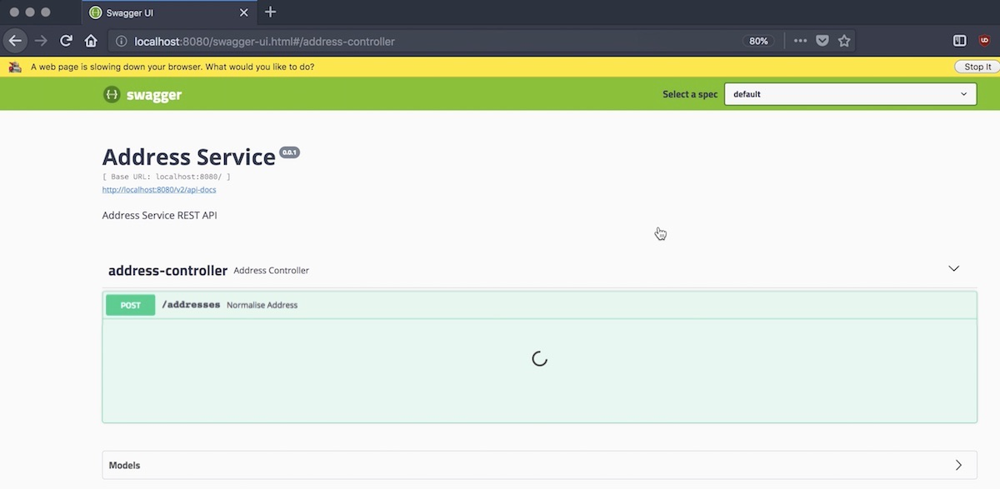
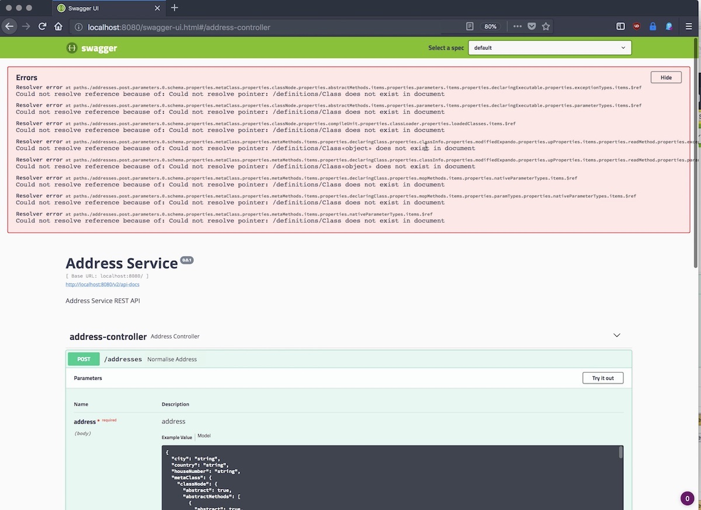

# Springfox Groovy Issue

Demonstrates my issue integrating [Swagger](https://swagger.io) via [SpringFox](https://springfox.github.io/springfox/) into a [Groovy](http://www.groovy-lang.org/) SpringBoot application.

## Build

Run the following command to build the application

```
$ gradlew build
```

## Run

The following command executes the application excluding the swagger integration.

```
$ java -D"dev.swagger.enabled=false" -jar build/libs/demo-service-0.0.1.jar

  .   ____          _            __ _ _
 /\\ / ___'_ __ _ _(_)_ __  __ _ \ \ \ \
( ( )\___ | '_ | '_| | '_ \/ _` | \ \ \ \
 \\/  ___)| |_)| | | | | || (_| |  ) ) ) )
  '  |____| .__|_| |_|_| |_\__, | / / / /
 =========|_|==============|___/=/_/_/_/
 :: Spring Boot ::        (v2.1.3.RELEASE)

2019-03-09 19:39:16.484 INFO -- [main] o.s.b.w.embedded.tomcat.TomcatWebServer  : Tomcat initialized with port(s): 8080 (http)
2019-03-09 19:39:16.517 INFO -- [main] o.apache.catalina.core.StandardService   : Starting service [Tomcat]
2019-03-09 19:39:16.517 INFO -- [main] org.apache.catalina.core.StandardEngine  : Starting Servlet engine: [Apache Tomcat/9.0.16]
2019-03-09 19:39:16.763 INFO -- [main] o.a.c.c.C.[Tomcat].[localhost].[/]       : Initializing Spring embedded WebApplicationContext
2019-03-09 19:39:16.764 INFO -- [main] o.s.web.context.ContextLoader            : Root WebApplicationContext: initialization completed in 1711 ms
2019-03-09 19:39:17.321 INFO -- [main] o.s.s.concurrent.ThreadPoolTaskExecutor  : Initializing ExecutorService 'applicationTaskExecutor'
2019-03-09 19:39:17.692 INFO -- [main] o.s.b.a.e.web.EndpointLinksResolver      : Exposing 2 endpoint(s) beneath base path '/actuator'
2019-03-09 19:39:17.781 INFO -- [main] o.s.b.w.embedded.tomcat.TomcatWebServer  : Tomcat started on port(s): 8080 (http) with context path ''
2019-03-09 19:39:17.790 INFO -- [main] n.marcusolk.springfoxissue.Application   : Started Application in 3.236 seconds (JVM running for 4.154)
```

So the startup time for such a trivial application is as expected around 3 seconds.

### Demonstrating the issue

The following command executes the application including the swagger integration.

```
$ java -D"dev.swagger.enabled=true" -jar build/libs/demo-service-0.0.1.jar

  .   ____          _            __ _ _
 /\\ / ___'_ __ _ _(_)_ __  __ _ \ \ \ \
( ( )\___ | '_ | '_| | '_ \/ _` | \ \ \ \
 \\/  ___)| |_)| | | | | || (_| |  ) ) ) )
  '  |____| .__|_| |_|_| |_\__, | / / / /
 =========|_|==============|___/=/_/_/_/
 :: Spring Boot ::        (v2.1.3.RELEASE)

2019-03-09 19:49:23.665  INFO 92064 --- [           main] o.s.b.w.embedded.tomcat.TomcatWebServer  : Tomcat initialized with port(s): 8080 (http)
2019-03-09 19:49:23.695  INFO 92064 --- [           main] o.apache.catalina.core.StandardService   : Starting service [Tomcat]
2019-03-09 19:49:23.695  INFO 92064 --- [           main] org.apache.catalina.core.StandardEngine  : Starting Servlet engine: [Apache Tomcat/9.0.16]
2019-03-09 19:49:23.791  INFO 92064 --- [           main] o.a.c.c.C.[Tomcat].[localhost].[/]       : Initializing Spring embedded WebApplicationContext
2019-03-09 19:49:23.791  INFO 92064 --- [           main] o.s.web.context.ContextLoader            : Root WebApplicationContext: initialization completed in 1659 ms
2019-03-09 19:49:24.490  INFO 92064 --- [           main] o.s.b.a.e.web.EndpointLinksResolver      : Exposing 2 endpoint(s) beneath base path '/actuator'
2019-03-09 19:49:24.577  INFO 92064 --- [           main] pertySourcedRequestMappingHandlerMapping : Mapped URL path [/v2/api-docs] onto method [public org.springframework.http.ResponseEntity<springfox.documentation.spring.web.json.Json> springfox.documentation.swagger2.web.Swagger2Controller.getDocumentation(java.lang.String,javax.servlet.http.HttpServletRequest)]
2019-03-09 19:49:24.795  INFO 92064 --- [           main] o.s.s.concurrent.ThreadPoolTaskExecutor  : Initializing ExecutorService 'applicationTaskExecutor'
2019-03-09 19:49:25.111  INFO 92064 --- [           main] d.s.w.p.DocumentationPluginsBootstrapper : Context refreshed
2019-03-09 19:49:25.143  INFO 92064 --- [           main] d.s.w.p.DocumentationPluginsBootstrapper : Found 1 custom documentation plugin(s)
2019-03-09 19:49:25.172  INFO 92064 --- [           main] s.d.s.w.s.ApiListingReferenceScanner     : Scanning for api listing references
2019-03-09 19:49:29.519  INFO 92064 --- [           main] o.s.b.w.embedded.tomcat.TomcatWebServer  : Tomcat started on port(s): 8080 (http) with context path ''
2019-03-09 19:49:29.522  INFO 92064 --- [           main] n.marcusolk.springfoxissue.Application   : Started Application in 7.718 seconds (JVM running for 8.415)
```

'_Scanning for api listing references_' in class `ApiListingReferenceScanner` takes 5 seconds and the whole startup takes almost 8 seconds now.

This delay might be connected to the issue when opening the swagger ui in a browser. The swagger ui starts up but fails to load when opening the UI for sending a request.
It takes a minute until errors appear as depicted below.

The swagger ui is simply not usable here.




 